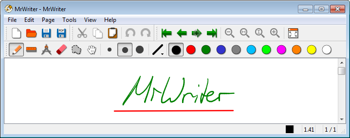

### Welcome to MrWriter.
MrWriter is an application aiming to replace both pen and paper for handwritten note taking, as well as blackboards for giving lectures in front of students. It is highly inspired by Xournal / Xournal++ but the focus is more on taking notes and platform independence, rather than PDF annotation. Xournal files (.xoj) can be imported, but only strokes get recognized.

### Download

| Platform | Download |
| --- | --- |
| Linux (AppImage) | [MrWriter-0.0.4.-x86_64.AppImage](https://github.com/unruhschuh/MrWriter/releases/download/v0.0.4/MrWriter-0.0.4-x86_64.AppImage) |
| Mac OS X | [MrWriter-0.0.4.dmg](https://github.com/unruhschuh/MrWriter/releases/download/v0.0.4/MrWriter-0.0.4.dmg) |
| Windows | [MrWriter-0.0.4_Win.zip](https://github.com/unruhschuh/MrWriter/releases/download/v0.0.4/MrWriter-0.0.4_Win.zip) |

Older versions and the source code can be downloaded [here](https://github.com/unruhschuh/MrWriter/releases).

### Screenshots
#### Linux

#### Windows

#### Mac OS X

### Author
MrWriter is written by Thomas Leitz ([@unruhschuh](http://github.com/unruhschuh)) and licensed under the GNU General Public License 3.0. MrWriter is written in C++/Qt and runs on Linux, Windows and Mac OS X.

### Support or Contact
If you have any questions, or wish to contribute, feel free to contact me via e-mail: thomas.leitz@web.de.

